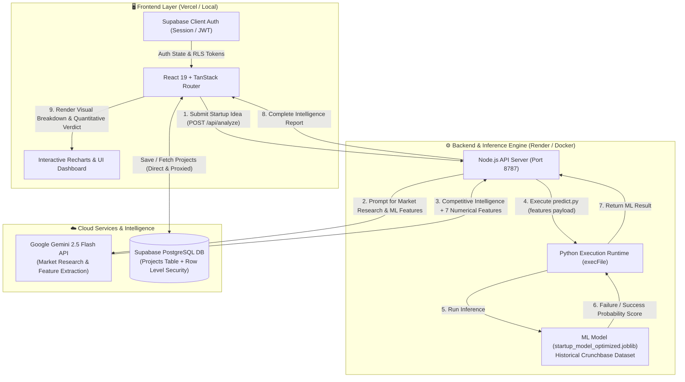

# 🚀 Smart Failure Detection

### *AI-Powered Startup Failure Prediction & Market Intelligence Platform*

[](https://react.dev/)
[](https://www.typescriptlang.org/)
[](https://vitejs.dev/)
[](https://nodejs.org/)
[](https://www.python.org/)
[](https://xgboost.readthedocs.io/)
[](https://ai.google.dev/)
[](https://supabase.com/)
[](https://render.com/)
[](https://vercel.com/)
[](LICENSE)

---

## 👥 Core Team Members

| Name | Role | Focus Area |
| :--- | :--- | :--- |
| 🧑‍💻 **Aryan Saini** | Project Lead & Full-Stack | System Architecture, Frontend UI/UX, Backend API Integration |
| 👨‍💻 **Ansh Patel** | Machine Learning Engineer | Model Training, XGBoost Pipeline, Dataset Optimization |
| 👩‍💻 **Isha Zope** | Data & Intelligence | Gemini AI Feature Engineering, Prompt Architecture, Analytics |
| 👩‍💻 **Jeevitha** | Cloud & Quality Assurance | Supabase PostgreSQL Security, API Routing, System Testing |

---

## 📋 Table of Contents

1. [🌟 Project Introduction](#-project-introduction)
2. [🛑 Problem Statement](#-problem-statement)
3. [💡 Key Value Propositions](#-key-value-propositions)
4. [✨ Key Features](#-key-features)
5. [🛠️ Tech Stack](#-tech-stack)
6. [🏗️ System Architecture](#-system-architecture)
7. [🔄 AI & Machine Learning Pipeline](#-ai--machine-learning-pipeline)
8. [📦 Installation & Setup](#-installation--setup)
9. [🚀 Quick Start](#-quick-start)
10. [🌐 Production Deployment](#-production-deployment)
11. [📁 Repository Structure](#-repository-structure)
12. [📄 License & Credits](#-license--credits)

---

## 🌟 Project Introduction

**Smart Failure Detection** is an intelligent, full-stack decision-support workspace designed to help entrepreneurs, venture capitalists, and product teams quantitatively and qualitatively evaluate the viability of early-stage startups.

By combining the predictive power of a **custom Machine Learning model** (trained on 48,000+ historical startup outcomes) with the real-time reasoning of **Google Gemini 2.5 Flash**, the platform acts as an automated venture due diligence analyst.

### 🎯 What We Deliver
- 🧠 **Statistical Failure & Success Probability**: Exact risk probabilities calculated from historical Crunchbase venture data.
- 🔍 **Automated Competitor Intelligence**: Real-time identification of direct rivals, strengths, weaknesses, and market overlap.
- 📈 **Predictive Financial Projections**: Dynamic 6-month revenue and burn rate modeling customized to budget and industry benchmarks.
- 🛡️ **Cloud-Synced Scenario Modeling**: Instant history saving and versioning powered by Supabase PostgreSQL and Row-Level Security.

---

## 🛑 Problem Statement

It is a well-established reality in venture finance that **over 90% of early-stage startups fail**. The root causes are often preventable:
- Misjudging target market size and demand.
- Premature capital burn and inadequate runway planning.
- Underestimating entrenched competition and distribution moats.
- Operating within an echo chamber without unbiased, quantitative data.

Traditional venture due diligence is slow, opaque, and inaccessible to early-stage founders. Generic chatbots lack mathematical rigor, while static spreadsheets fail to capture real-time market dynamics. **Smart Failure Detection bridges this gap.**

---

## 💡 Key Value Propositions

| Target User | Core Value Proposition |
| :--- | :--- |
| 🚀 **Early-Stage Founders** | Stress-test pitch assumptions, identify blindspots, and calculate runway before spending capital |
| 💼 **Angel Investors & VCs** | Rapid quantitative pre-screening of inbound deal flow and pitch decks |
| 🏢 **Accelerators & Incubators** | Track cohort risk profiles and guide portfolio companies through iterative business pivots |
| 📊 **Product & Strategy Teams** | Evaluate new product lines, business models, and market positioning with AI benchmarks |

---

## ✨ Key Features

### 🧠 **Quantitative Machine Learning Verdict**
- Custom-trained classification model (`startup_model_optimized.joblib`) based on XGBoost & Random Forest ensembles.
- Evaluates 7 key venture attributes: Total Capital, Funding Rounds, Funding Duration, Velocity to First Funding, Country Code, and Industry Category.
- Delivers clear **Failure vs. Success Probability** confidence meters.

### 🤖 **Generative AI Market Due Diligence**
- Powered by Google Gemini 2.5 Flash.
- Analyzes unstructured text descriptions into structured market positioning matrices.
- Discovers direct competitors with specific operational strengths and vulnerabilities.

### 📊 **Multi-Dimensional Risk Breakdown**
- Real-time scoring across four pillars: **Market Risk**, **Capital Risk**, **Execution Risk**, and **Competitive Risk**.
- Color-coded hazard gauges highlighting areas needing urgent founder intervention.

### 📈 **Dynamic Financial Ramp & Runway**
- Automated 6-month financial trajectory modeling month-by-month revenue vs. operational costs.
- Automatically adjusts according to industry-specific CAGR growth rates.

### 🗄️ **History, Duplication & Guest Session**
- **Supabase Cloud Sync**: Save multiple startup scenarios to track how pivoting business models alters risk.
- **Duplicate & Edit**: One-click cloning of previous assessments for rapid A/B hypothesis testing.
- **Guest / Demo Mode**: Instant evaluation without requiring upfront account creation.

---

## 🛠️ Tech Stack

### **Frontend Interface**
| Technology | Role |
| :--- | :--- |
|  | Component architecture and state management |
|  | Fully type-safe client-side routing & navigation |
|  | Modern dark-mode styling and glassmorphism design system |
|  | Interactive financial charts, risk meters, and segment breakdowns |
|  | Vector icons and clean UI aesthetics |

### **Backend & Inference API**
| Technology | Role |
| :--- | :--- |
|  | Custom HTTP API server handling cross-origin requests & proxying |
|  | High-performance asynchronous execution bridge to Python ML engine |
|  | Cloud database operations and authentication middleware |

### **Machine Learning & AI Engine**
| Technology | Role |
| :--- | :--- |
|  | Live market research, competitor extraction & feature synthesis |
|  | Core machine learning runtime |
|  | Gradient boosted decision trees for startup failure classification |
|  | Preprocessing pipelines, encoders, and model calibration |
|  | Vectorized feature manipulation and transformation |

### **Cloud Storage & Database**
| Technology | Role |
| :--- | :--- |
|  | Relational database storing user records, metadata, and JSON analysis payloads |
|  | Granular user data isolation and authorization policies |

---

## 🏗️ System Architecture

### 🏛️ High-Level System Architecture



---

## 🔄 AI & Machine Learning Pipeline

### 📊 End-to-End Predictive Data Flow

```mermaid
graph TD
    INPUT["📝 STARTUP INPUT<br/>(Name, Industry, Model, Budget, Description)"] --> DISPATCH["1️⃣ FRONTEND SUBMISSION<br/>• Validate input parameters<br/>• Transmit to Node.js Backend API"]
    
    DISPATCH --> GEMINI["2️⃣ GOOGLE GEMINI 2.5 FLASH<br/>• In-depth market & competitor research<br/>• Risk factor analysis across 4 categories<br/>• Synthesize 7 quantitative ML features"]
    
    GEMINI --> EXTRACT["3️⃣ FEATURE EXTRACTION<br/>• funding_total_usd<br/>• funding_rounds<br/>• funding_duration<br/>• time_to_first_funding<br/>• category_count<br/>• country_code<br/>• main_category"]
    
    EXTRACT --> RUNTIME["4️⃣ PYTHON INFERENCE RUNTIME<br/>• Spawn server/ml/predict.py via execFile<br/>• Feed extracted numerical feature vector"]
    
    RUNTIME --> MODEL["5️⃣ TRAINED CLASSIFICATION MODEL<br/>• Load startup_model_optimized.joblib<br/>• Apply feature encodings & scaling<br/>• Compute statistical decision trees"]
    
    MODEL --> PROB["6️⃣ STATISTICAL PROBABILITY<br/>• Failure Probability %<br/>• Success Probability %<br/>• Quantitative Verdict (Success / Failure)"]
    
    PROB --> MERGE["7️⃣ UNIFIED PAYLOAD SYNTHESIS<br/>• Combine Gemini qualitative insights<br/>• Attach ML statistical verdict<br/>• Generate strategic founder suggestions"]
    
    MERGE --> UI["8️⃣ REACTIVE DASHBOARD<br/>• Render Failure / Success Verdict Card<br/>• Plot 6-Month Projections & Competitors<br/>• Interactive Risk Gauges"]
    
    UI --> DB[("9️⃣ SUPABASE CLOUD SAVE<br/>• Persist project record to PostgreSQL<br/>• Associate with authenticated user ID")]
    
    style INPUT fill:#3B82F6,stroke:#1D4ED8,stroke-width:2px,color:#fff
    style DISPATCH fill:#6366F1,stroke:#4338CA,stroke-width:2px,color:#fff
    style GEMINI fill:#8B5CF6,stroke:#6D28D9,stroke-width:2px,color:#fff
    style EXTRACT fill:#EC4899,stroke:#BE185D,stroke-width:2px,color:#fff
    style RUNTIME fill:#F59E0B,stroke:#B45309,stroke-width:2px,color:#fff
    style MODEL fill:#EF4444,stroke:#B91C1C,stroke-width:2px,color:#fff
    style PROB fill:#10B981,stroke:#047857,stroke-width:2px,color:#fff
    style MERGE fill:#06B6D4,stroke:#0E7490,stroke-width:2px,color:#fff
    style UI fill:#3B82F6,stroke:#1D4ED8,stroke-width:3px,color:#fff
    style DB fill:#10B981,stroke:#047857,stroke-width:2px,color:#fff
```



---

## 📦 Installation & Setup

### 📋 Prerequisites
- **Node.js**: v20 or v22 (Recommended)
- **Python**: v3.9 or higher
- **Supabase Account**: Free Tier ([supabase.com](https://supabase.com/))
- **Google Gemini API Key**: Free Tier ([aistudio.google.com](https://aistudio.google.com/))

### Step 1: Clone the Repository
```bash
git clone https://github.com/aryan-saini-dev/smart-failure-detection.git
cd smart-failure-detection
```

### Step 2: Install Node Dependencies
```bash
npm install
```

### Step 3: Set Up Python ML Virtual Environment
The Node backend executes the machine learning model through this Python environment:
```bash
cd Dataset
python -m venv venv

# On Windows (PowerShell):
.\venv\Scripts\Activate.ps1
# On macOS/Linux:
source venv/bin/activate

# Install ML dependencies
pip install -r ../requirements.txt
cd ..
```

### Step 4: Configure Supabase Database
1. Create a new project in your [Supabase Dashboard](https://supabase.com/dashboard).
2. Navigate to **Authentication -> Providers -> Email** and disable "Confirm email" for immediate signup testing.
3. Open the **SQL Editor** in Supabase and run the schema script:
   ```sql
   CREATE TABLE projects (
     id UUID PRIMARY KEY DEFAULT gen_random_uuid(),
     user_id UUID NOT NULL REFERENCES auth.users(id) ON DELETE CASCADE,
     name TEXT NOT NULL,
     industry TEXT NOT NULL,
     business_model TEXT NOT NULL,
     target_market TEXT NOT NULL,
     budget NUMERIC NOT NULL DEFAULT 0,
     description TEXT NOT NULL,
     analysis_data JSONB,
     created_at TIMESTAMPTZ NOT NULL DEFAULT now()
   );

   ALTER TABLE projects ENABLE ROW LEVEL SECURITY;
   
   CREATE POLICY "Users can manage their own projects" 
   ON projects FOR ALL 
   USING (auth.uid() = user_id);
   ```

### Step 5: Configure Environment Variables
Copy the example environment file in the project root:
```bash
cp .env.example .env
```
Populate `.env` with your API credentials:
```env
# Google Gemini AI Key
GEMINI_API_KEY=your_gemini_api_key_here

# Backend API Configuration
VITE_API_BASE_URL=http://localhost:8787
API_PORT=8787

# Supabase Credentials
VITE_SUPABASE_URL=https://your-project-id.supabase.co
VITE_SUPABASE_ANON_KEY=your-supabase-anon-key
```

---

## 🚀 Quick Start

### Start the Local Servers

Open **two terminal windows** in the root directory:

**Terminal 1 (Backend API & ML Engine)**:
```bash
npm run api
```
*Server starts on `http://localhost:8787`*

**Terminal 2 (Frontend React Application)**:
```bash
npm run dev
```
*Frontend launches at `http://localhost:3000` (or `3001` if 3000 is occupied)*

### 📝 Setup Verification Checklist
- [ ] Python virtual environment created in `Dataset/venv` with `requirements.txt` installed.
- [ ] Valid `GEMINI_API_KEY` provided in `.env`.
- [ ] Supabase project created and `projects` table configured with RLS.
- [ ] Backend server running on port `8787`.
- [ ] Frontend running on port `3000` connected to `http://localhost:8787`.

---

## 🌐 Production Deployment

| Service | Hosting Platform | Notes |
| :--- | :--- | :--- |
| **Frontend** | **Vercel** | Configured with TanStack Start Nitro preset (`preset: "vercel"`) |
| **Backend & ML** | **Render (Docker)** | Packaged with Node 22 + Python 3 + XGBoost in unified container |

### Vercel Environment Variables:
- `VITE_API_BASE_URL`: `https://smart-failure-detection.onrender.com`
- `VITE_SUPABASE_URL`: `https://your-project-id.supabase.co`
- `VITE_SUPABASE_ANON_KEY`: `your-anon-key`

---

## 📁 Repository Structure

```
smart-failure-detection/
├── Dataset/                           # ML Training & Research
│   ├── startup_failure_prediction.csv # 48,000+ Startup Dataset
│   ├── train_model.py                 # Training script for XGBoost & Random Forest
│   ├── startup_model_optimized.joblib # Serialized inference pipeline
│   └── dataset_documentation.md       # Statistical documentation
├── server/                            # Backend Engine
│   ├── index.js                       # Node.js HTTP API & Gemini integration
│   └── ml/
│       └── predict.py                 # Python ML inference bridge
├── src/                               # Frontend Application (React 19)
│   ├── components/                    # UI Components & Aurora Canvas
│   ├── lib/
│   │   ├── analysis.ts                # Financial algorithms & type definitions
│   │   ├── local-api.ts               # Backend API client
│   │   └── supabase.ts                # Supabase SDK client
│   └── routes/                        # TanStack Router Pages
│       ├── index.tsx                  # Landing Page
│       ├── login.tsx                  # Authentication & Guest Demo
│       ├── project-input.tsx          # Startup Analysis Form & Dashboard
│       ├── profile.tsx                # Saved Assessment History
│       └── projects/
│           └── $projectId.tsx         # Detailed Project View
├── Dockerfile                         # Production Docker container for Render
├── package.json                       # Node dependencies
├── requirements.txt                   # Python ML dependencies
└── vite.config.ts                     # Vite + Nitro configuration
```

---

## 📄 License & Credits

### 📜 Software License
This project is licensed under the **MIT License**. See the `LICENSE` file for details.

---

## ⭐ Star Us!

If you find this project helpful for startup validation or machine learning exploration, please give it a ⭐ on [GitHub](https://github.com/aryan-saini-dev/smart-failure-detection)!

---

<div align="center">

**Built with ❤️ by Aryan Saini, Ansh Patel, Isha Zope & Jeevitha**

*Empowering Founders with Venture-Grade Machine Intelligence* 🚀📊

**Happy Building! 💡✨**

</div>
